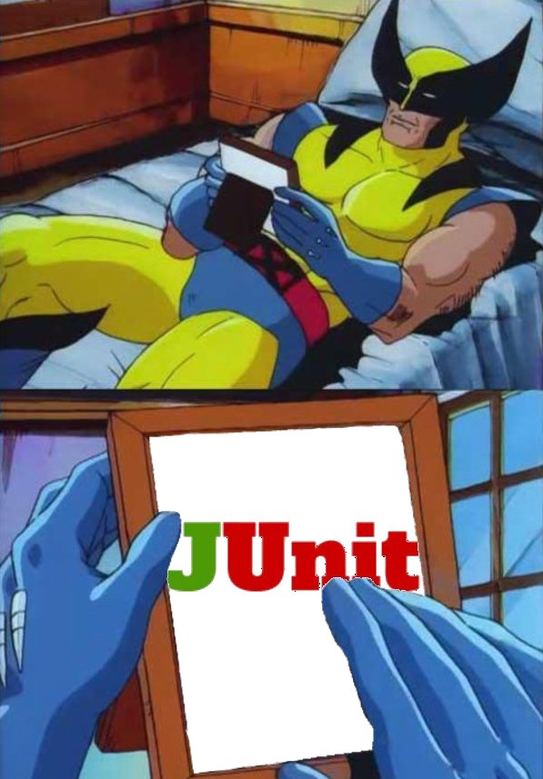

# Workshop de testes unitários

## Introdução
O Professor Charles Xavier estava diante de um novo desafio. A Escola para Jovens Superdotados Xavier recebia cada vez mais alunos, 
e manter um registro eficiente das habilidades, progressos e necessidades individuais se tornava uma tarefa monumental. 
Até então, ele confiava em sua memória aprimorada e em algumas anotações dispersas, mas isso não era mais suficiente.

A partir da criação do sistema de cadastro de alunos, a Escola Xavier tornou-se ainda mais eficiente, permitindo que os X-Men treinassem e 
orientassem os novos mutantes com um controle detalhado de suas capacidades e progressos. 
Assim, Charles Xavier garantiu que cada jovem superdotado encontrasse seu caminho da melhor maneira possível, dentro e fora da escola.

## Executando o projeto

Para executar o projeto é necessário que você tenha o SDK do [Java 17] na sua máquina e o [maven] configurado.

## Testes Unitários

[maven]: (https://maven.apache.org/install.html)
[Java 17]: (https://www.oracle.com/java/technologies/javase/jdk17-archive-downloads.html)