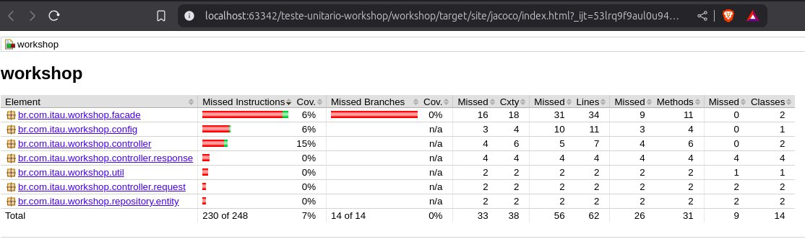

# Workshop de testes unitários

## Introdução
O Professor Charles Xavier estava diante de um novo desafio. A Escola para Jovens Superdotados Xavier recebia cada vez mais alunos,
e manter um registro eficiente das habilidades, progressos e necessidades individuais se tornava uma tarefa monumental.
Até então, ele confiava em sua memória aprimorada e em algumas anotações dispersas, mas isso não era mais suficiente.

A partir da criação do sistema de cadastro de alunos, a Escola Xavier tornou-se ainda mais eficiente, permitindo que os X-Men treinassem e
orientassem os novos mutantes com um controle detalhado de suas capacidades e progressos.
Assim, Charles Xavier garantiu que cada jovem superdotado encontrasse seu caminho da melhor maneira possível, dentro e fora da escola.

## Testes Unitários

Infelizmente o projeto ainda não tem nenhum teste unitário.</br>
Sua missão é criar testes relevantes que cubram todos os cenários possíveis do código que está desenvolvido.

Use as ferramentas de IA para facilitar o seu trabalho: Stackspot e/ou Copilot</br>
Na hora de criar os prompts de IA, use inglês para ter uma maior precisão nas respostas.


## Executando o projeto

Você vai precisar de:
* [Java 17+]
* [maven]
* uma IDE que esteja familiarizado: Intellij, Eclipse, VS Code, vi.
* paciência e atenção

```bash
# builda a app e roda a verificação do jacoco de cobertura de testes
mvn clean package
```

Se você quiser buildar a app e pular a parte de testes:

```bash
mvn clean package -DskipTests
```

### Swagger e testes locais

Após iniciar a aplicação é possível listar todos os endpoints através do endereço:
http://localhost:8080/swagger-ui/index.html

### Banco de dados H2

No projeto do workshop é usado o banco de dados H2, que é populado através dos scripts do flyway toda vez que é reiniciado.

Para acessar o console do banco de dados você pode entrar na url http://localhost:8080/h2-console

O usuário e senha de acesso ao banco de dados estão dentro do arquivo `flyway.conf` na raiz do projeto.

# Jacoco

Ao executar o comando de build do maven `mvn clean package` inicialmente, o projeto irá buildar com erro,
pois não possui uma cobertura de testes adequada.
Dentro do arquivo `./target/site/index.html` está um relatório com a cobertura de código, conforme no exemplo abaixo:


[maven]: (https://maven.apache.org/install.html)
[Java 17+]: (https://www.oracle.com/java/technologies/javase/jdk17-archive-downloads.html)